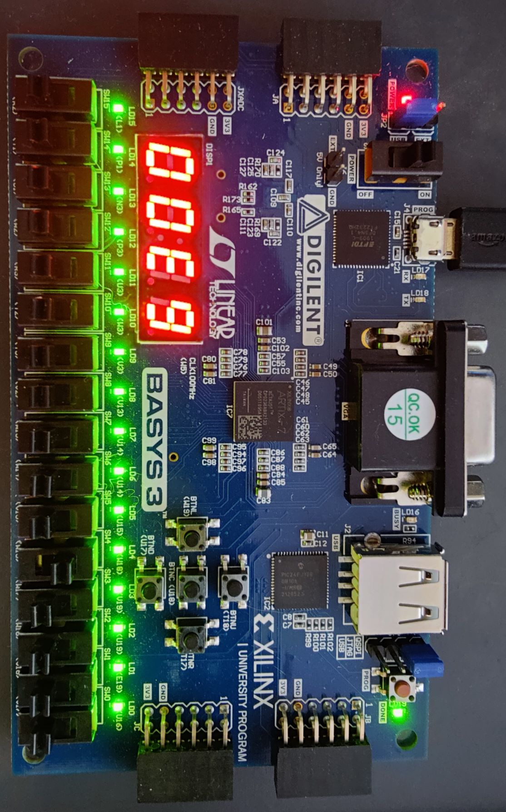

# SAP
Simple As Possible computer, based off [Ben Eater's series](https://eater.net/8bit/).

Includes Assembler, Virtual Machine, Microcode generator and FPGA implementation for [Basys 3 Artix-7](https://digilent.com/shop/basys-3-artix-7-fpga-trainer-board-recommended-for-introductory-users/).

# Building
1. Build tools (ASM, UCode, VM): ```Scripts\build_solution.cmd```
2. Build programs: ```Scripts\build_programs.cmd```.
Optionally run: ```Scripts\run_programs.cmd```.
3. Build Microcode (for FPGA): ```Scripts\build_microcode.cmd```. Modify [Ram.v](FPGA\sap1.srcs\sources_1\new\RAM.v) with program to run. 
4. Build FPGA: [sap1.xpr](FPGA\sap1.xpr).

# Programs

## Add
[Add.asm](Programs\add.asm)
```
SAP1 Virtual Machine
Out:
0x8

Machine State:
PC 0x5
A 0x8
B 0x2
CF 0
ZF 0
OUT 0x8
```

## Fib
[Fib.asm](Programs\fib.asm)
```
SAP1 Virtual Machine
Out:
0x0
0x1
0x1
0x2
0x3
0x5
0x8
0xd
0x15
0x22
0x37
0x59
0x90
0xe9

Machine State:
PC 0xe
A 0x79
B 0xe9
CF 1
ZF 0
OUT 0xe9
```
Running on BASYS 3:
